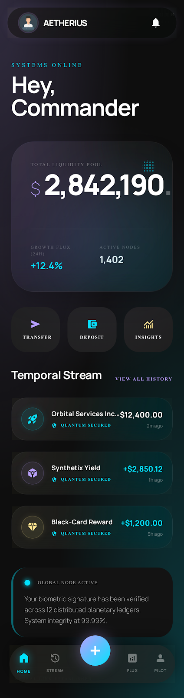
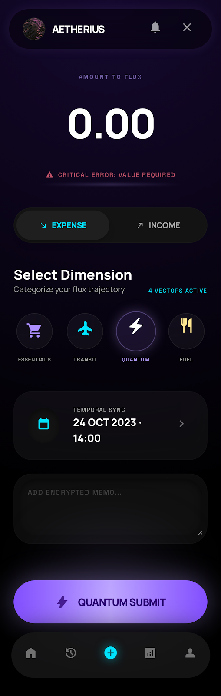
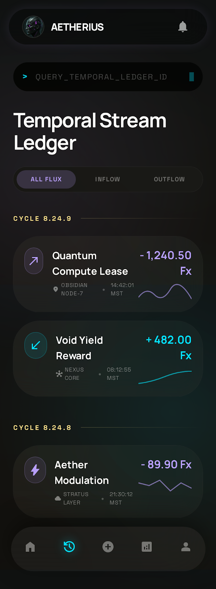
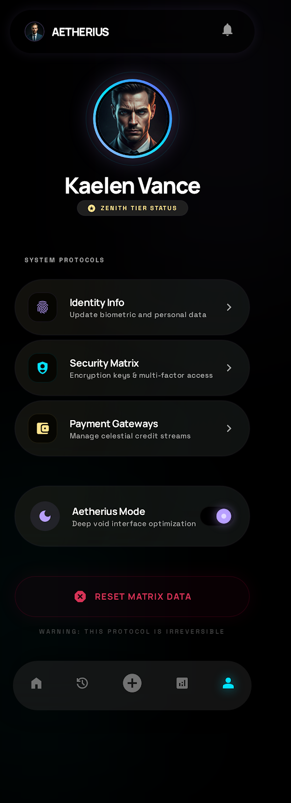
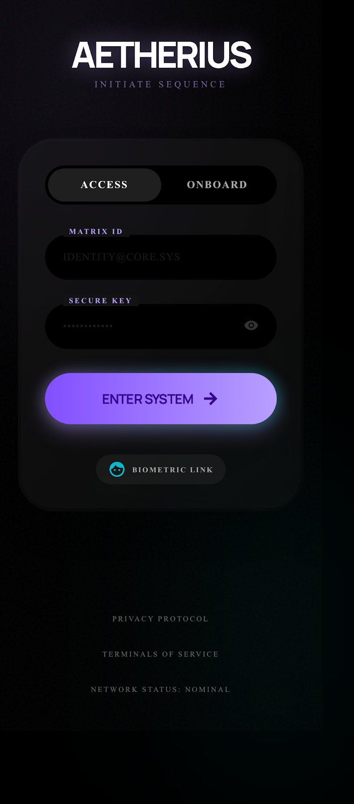
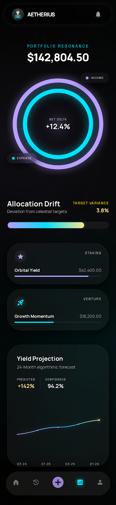

# Aetherius Expense Tracker

A modern React Native + Expo expense tracker focused on speed, clarity, and fully local data ownership.

## Overview

Aetherius helps you capture income and expenses in seconds, then understand your money flow through clean analytics and category-level insights. The app uses a custom visual system, smooth interactions, and on-device persistence.

## Highlights

- Fast transaction capture with category selection, notes, date picker, and validation.
- Home dashboard with balance, income/expense summary, and recent activity.
- Full history view with search and filters (all, income, expense).
- Analytics dashboard with income-vs-expense bars and category breakdown.
- Profile management with display name, email, and currency settings.
- Theme toggle (dark/light mode).
- CSV export for transactions.
- Fully local storage using AsyncStorage (no backend required).
- Haptic feedback for key actions.

## Screenshots

| Gateway | Home |
|---|---|
|  |  |

| Add Transaction | History |
|---|---|
|  |  |

| Analytics | Profile |
|---|---|
|  |  |

## Tech Stack

- React Native 0.81
- Expo SDK 54
- TypeScript
- React Navigation (stack + bottom tabs)
- Zustand + persistence middleware
- AsyncStorage
- Expo modules: haptics, sharing, file-system, linear-gradient

## Project Structure

```text
src/
  components/        Reusable UI components
  hooks/             App behavior and feature hooks
  navigation/        Stack and tab navigation setup
  screens/           Screen-level UI and interactions
  store/             Zustand app store and persistence
  utils/             Formatting, categories, calculations
```

## Getting Started

### Prerequisites

- Node.js 18+
- npm 9+
- Expo Go app on your phone (Android/iOS)

### Installation

```bash
npm install
```

### Run In Expo Go

```bash
npx expo start --tunnel
```

Then scan the QR code from your terminal using Expo Go.

## Available Scripts

```bash
npm run start    # Expo dev server
npm run android  # Open Android flow
npm run ios      # Open iOS simulator flow
npm run web      # Open web build
```

## Data and Privacy

- All app data is stored locally on the device.
- No remote database is required.
- Reset Data clears local transactions and profile preferences.

## CSV Export

Export is available from the Profile screen.

- Output file: transactions_export.csv
- Columns: Date, Type, Category, Note, Amount, Currency
- Share flow uses the native OS share sheet.

## Troubleshooting

- If Metro reports a busy port, allow Expo to switch to the next free port.
- If phone cannot connect, use tunnel mode and ensure internet access.
- If app state looks stale, reload from Expo Go or restart the dev server.

## License

This project is private unless you choose to add an open-source license.
